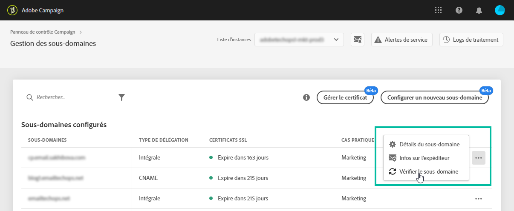

# Surveiller les sous-domaines {#monitoring-subdomains}

Il est essentiel de surveiller vos sous-domaines pour vous assurer qu’ils sont tous correctement configurés pour fonctionner avec Adobe Campaign.

La liste des sous-domaines de chacune de vos instances de production est directement accessible en sélectionnant la carte **[!UICONTROL Sous-domaines et certificats]**.

La colonne **[!UICONTROL Dernière vérification]** indique à quel moment un sous-domaine a été vérifié pour la dernière fois. Vous pouvez lancer une vérification à tout moment en cliquant sur le bouton **...** / **[!UICONTROL Vérifier le sous-domaine]**.

>[!IMPORTANT]
>
>Adobe déconseille d’utiliser des sous-domaines sans date de certificat, car cela peut entraîner des problèmes de délivrabilité pour ceux-ci.

Lors du lancement d’une vérification, plusieurs opérations sont effectuées pour contrôler que le sous-domaine est correctement configuré (contrôle du tenant d’instance, test d’envoi d’email, etc.) Si la vérification du sous-domaine échoue, contactez l’assistance clientèle Adobe pour plus d’informations.

**Rubriques connexes :**

* [Renouvellement du certificat SSL d’un sous-domaine](../../subdomains-certificates/using/renewing-subdomain-certificate.md)
* [Marque des sous-domaines](../../subdomains-certificates/using/subdomains-branding.md)
