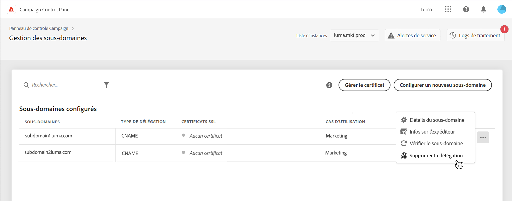
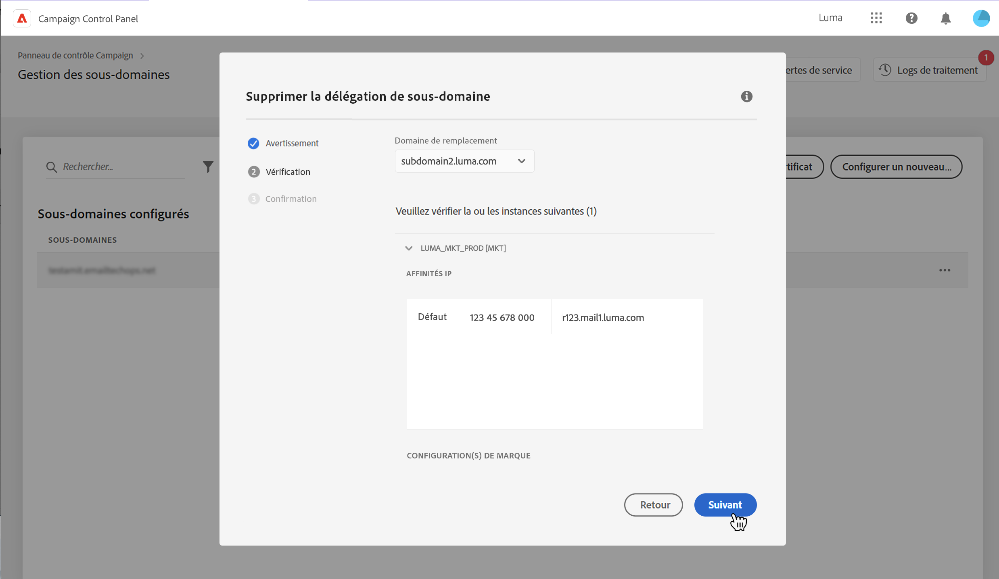
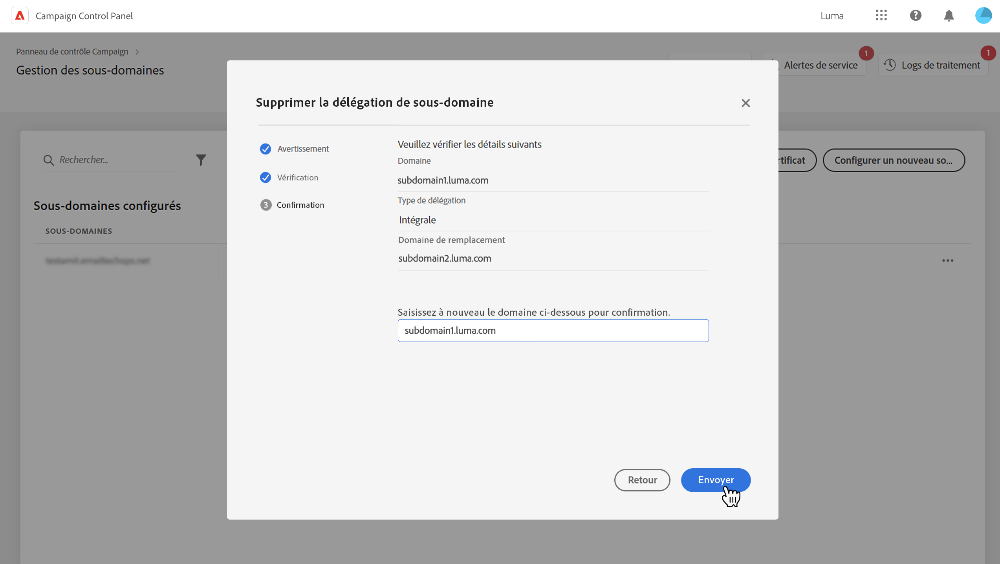
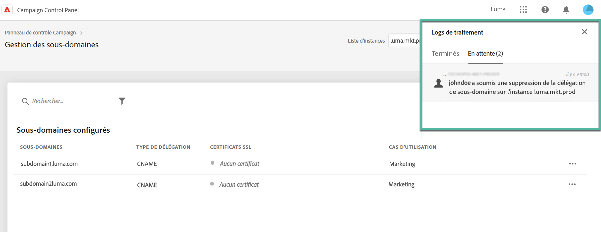
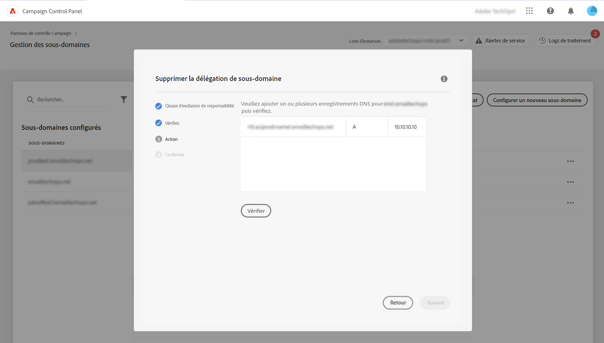

# Supprimer la délégation de sous-domaines à Adobe {#remove-delegated--subdomains}

>[!CONTEXTUALHELP]
>id="cp_subdomain_undelegate"
>title="Supprimer la délégation de sous-domaine"
>abstract="Cet écran vous permet de supprimer la délégation d’un sous-domaine à Adobe. Notez que ce processus ne peut pas être annulé et qu’il est irréversible tant que son exécution n’est pas terminée.  Si vous essayez de supprimer la délégation d’un domaine principal de l’instance sélectionnée, il vous sera demandé de choisir le domaine qui le remplacera."

Le panneau de contrôle vous permet de supprimer la délégation d’un sous-domaine qui a été entièrement délégué à Adobe ou délégué à l’aide de CNAME.

## Remarques importantes {#important}

Avant de poursuivre, examinez attentivement les impacts qui se produisent une fois le processus de suppression déclenché :

* Une fois le processus déclenché, la suppression de la délégation de sous-domaine ne peut plus être annulée et est irréversible tant que l’exécution du processus n’est pas terminée.
* Aucune autre délégation de sous-domaine ne peut être supprimée lorsqu’un processus similaire sur un autre sous-domaine est en cours.
* Une délégation supprimée sur un sous-domaine ne peut pas être déléguée à nouveau dans les 3 jours suivant sa suppression.

## Supprimer la délégation d’un sous-domaine {#steps}

Pour supprimer la délégation d’un sous-domaine à Adobe, procédez comme suit :

1. Cliquez sur le bouton représentant des points de suspension en regard de la délégation de domaine à supprimer, puis sélectionnez **[!UICONTROL Supprimer la délégation]**.

   

1. Consultez la clause d’exclusion de responsabilité et reconnaissez la suppression de la délégation de domaine à Adobe.

1. Consultez les informations concernant l’instance à laquelle le sous-domaine est associé, y compris les affinités IP associées et les configurations de marque.

   Si vous supprimez la délégation du domaine principal pour l’instance sélectionnée, vous devez choisir le domaine qui le remplacera à l’aide de la liste **[!UICONTROL Domaine de remplacement]**.

   Cliquez sur **[!UICONTROL Suivant]** pour procéder à la suppression.

   

1. Si vous supprimez une délégation de type CNAME ou que vous remplacez un domaine principal par un domaine délégué à l’aide de CNAME, vous êtes invité(e) à réaliser une **[!UICONTROL Action]** supplémentaire et à gérer les enregistrements DNS. [En savoir plus dans cette section](#dns)

1. Examinez le résumé qui s’affiche. Pour confirmer la suppression, saisissez l’URL du domaine pour lequel vous souhaitez supprimer la délégation, puis cliquez sur **[!UICONTROL Envoyer]**.

   

Une fois la suppression de la délégation initiée, le traitement en attente s’affiche dans les logs de traitements jusqu’à ce qu’il soit terminé.

## Gestion des enregistrements DNS {#dns}

Pour configurer une délégation de domaine à l’aide de CNAME dans le panneau de contrôle, vous devez ajouter des enregistrements spécifiques sur votre serveur DNS. [Découvrez comment configurer des sous-domaines à l’aide de CNAME](setting-up-new-subdomain.md#use-cnames).

Lors de la suppression d’une délégation de type CNAME, vous devez **supprimer ces enregistrements DNS** de votre serveur pour éviter tout problème. En outre, si vous souhaitez supprimer la délégation d’un sous-domaine principal et le remplacer par un domaine délégué à l’aide de CNAME, vous devrez peut-être **ajouter des enregistrements DNS** sur votre serveur, en fonction des affinités IP définies pour le sous-domaine.

Le tableau ci-dessous répertorie la ou les actions à effectuer en fonction du type de délégation que vous supprimez et de celui utilisé pour configurer le domaine de remplacement.

| Délégation supprimée | Délégation de domaine de remplacement | Action requise |
|  ---  |  ---  |  ---  |
| CNAME | Aucun domaine de remplacement | Supprimer les enregistrements DNS |
| CNAME | CNAME | Supprimer des enregistrements DNS Ajouter des enregistrements DNS *(facultatif en fonction des affinités IP)* |
| CNAME | Complet | Supprimer les enregistrements DNS |
| Complet | Aucun domaine de remplacement | Aucune action requise |
| Complet | CNAME | Ajouter des enregistrements DNS *(facultatif en fonction des affinités IP)* |
| Complet | Complet | Aucune action requise |

{style="table-layout:auto"}

Si l’une de ces actions est requise pour supprimer la délégation, une étape **[!DNL Action]** supplémentaire s’affiche avant de confirmer la suppression de la délégation. Cet écran répertorie les enregistrements DNS à supprimer ou à ajouter, selon le contexte.

### Supprimer les enregistrements DNS

1. Accédez au serveur DNS et supprimez les enregistrements répertoriés dans le panneau de contrôle.
1. Revenez au panneau de contrôle et cliquez sur **[!UICONTROL Suivant]** pour supprimer la délégation.

### Ajouter des enregistrements DNS

1. Accédez au serveur DNS et ajoutez les enregistrements répertoriés dans le panneau de contrôle.
1. Attendez que les enregistrements aient été ajoutés.
1. Revenez au panneau de contrôle et cliquez sur **[!UICONTROL Vérifier]**.
1. Une fois l’ajout des enregistrements vérifié, cliquez sur **[!UICONTROL Suivant]** pour supprimer la délégation.

## Codes d’erreur {#FAQ}

Cette section répertorie les messages d’erreur que vous pouvez rencontrer lors de la tentative de suppression de la délégation d’un sous-domaine :

| Code d’erreur | Message | Description |
|  ---  |  ---  |  ---  |
| 8002 | Impossible de supprimer le domaine délégué demandé en raison d’une demande similaire en cours. Réessayez dans 3 jours | Un traitement de suppression de délégation de sous-domaine est déjà en cours pour l’instance sélectionnée. Patientez 3 jours pour lancer un nouveau traitement de suppression. |
| 8003 | La suppression du domaine délégué demandé n’est pas prise en charge pour cette instance. | La suppression de la délégation n’est pas prise en charge pour le sous-domaine sélectionné en raison d’un problème technique. Contactez l’assistance clientèle. |
| 8004 | La suppression du domaine délégué demandé n’est pas autorisée, car il n’y a qu’un seul domaine dans cette instance. | Un seul sous-domaine a été délégué pour l’instance sélectionnée. La suppression de la délégation n’est pas autorisée. |
| 8005 | La suppression du domaine délégué demandé n’est pas prise en charge pour cette configuration. | La suppression de la délégation n’est pas prise en charge pour le sous-domaine sélectionné en raison d’un problème technique. Contactez l’assistance clientèle. |
| 8006 | La suppression du domaine délégué demandé n’est pas autorisée pour des raisons inconnues. Veuillez contacter l’assistance clientèle. | La suppression de la délégation n’est pas prise en charge pour l’instance sélectionnée en raison de problèmes inconnus, contactez l’assistance clientèle. |
