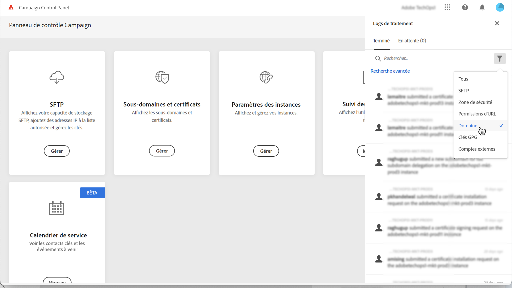
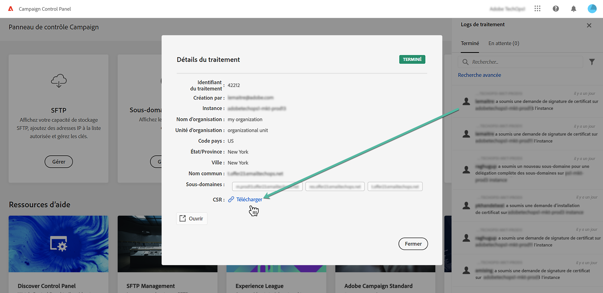

# Renouveler les certificats SSL {#renewing-subdomains-ssl-certificates}

>[!CONTEXTUALHELP]
>id="cp_add_ssl_certificate"
>title="Renouvellement du certificat SSL"
>abstract="Pour renouveler un certificat SSL, vous devez générer une demande de signature de certificat (CSR), acheter le certificat SSL pour vos sous-domaines et installer l’ensemble de certificats. Cette opération n’est nécessaire que si vous avez choisi de gérer les certificats manuellement plutôt que de les déléguer à Adobe. "

>[!NOTE]
>
>Le renouvellement des certificats SSL de vos sous-domaines n’est nécessaire que si vous choisissez de gérer les certificats vous-même plutôt que de déléguer ce processus à Adobe. Il est vivement recommandé de déléguer la gestion des certificats SSL de vos sous-domaines à Adobe, car Adobe crée automatiquement le certificat et le renouvelle tous les ans avant l’expiration. [En savoir plus sur la gestion des certificats SSL](monitoring-ssl-certificates.md#management)

La procédure de renouvellement des certificats SSL comprend 3 étapes :

1. **Génération de la demande de signature de certificat (CSR)**

   La demande de signature de certificat doit être générée pour l’instance et les sous-domaines que vous envisagez de sécuriser avant d’acheter un certificat.  Vous devrez fournir certaines informations nécessaires à la génération de la demande de signature de certificat (telles que le nom commun, le nom et l’adresse de l’organisation, etc.). [En savoir plus](#generate)

1. **Achat du certificat SSL**

   Une fois la CSR générée, vous pouvez l’utiliser pour acheter le certificat SSL auprès de l’autorité de certification approuvée par votre entreprise.

1. **Installation du certificat SSL**

   Installez le certificat SSL acheté sur le sous-domaine souhaité pour le sécuriser. [En savoir plus](#install)

 Découvrez cette fonctionnalité en vidéo dans [Campaign v7/v8](https://experienceleague.adobe.com/docs/campaign-classic-learn/control-panel/subdomains-and-certificates/adding-ssl-certificates.html?lang=fr#subdomains-and-certificates) ou [Campaign Standard](https://experienceleague.adobe.com/docs/campaign-standard-learn/control-panel/subdomains-and-certificates/adding-ssl-certificates.html?lang=fr#adding-ssl-certificates).

**Rubriques connexes :**

* [Guide des bonnes pratiques en matière de délivrabilité - Processus de demande de certificat SSL pour Adobe Campaign](https://experienceleague.adobe.com/docs/deliverability-learn/deliverability-best-practice-guide/additional-resources/campaign/ac-ssl-certificate-request.html?lang=fr)
* [Marque des sous-domaines](../../subdomains-certificates/using/subdomains-branding.md)
* [Surveillance de vos sous-domaines](../../subdomains-certificates/using/monitoring-subdomains.md)

## Générer la demande de signature de certificat (CSR) {#generate}

>[!CONTEXTUALHELP]
>id="cp_generate_csr"
>title="Génération dʼune demande de signature de certificat"
>abstract="La demande de signature de certificat doit être générée pour l’instance et les sous-domaines que vous envisagez de sécuriser avant d’acheter un certificat."

>[!CONTEXTUALHELP]
>id="cp_select_subdomains"
>title="Sélectionner les sous-domaines pour votre CSR"
>abstract="Vous pouvez choisir d’inclure tous les sous-domaines ou uniquement des sous-domaines spécifiques dans votre demande de signature de certificat. Seuls les sous-domaines sélectionnés seront certifiés par le biais du certificat SSL acheté."

Pour générer une demande de signature de certificat (CSR), procédez comme suit :

1. Dans la carte **[!UICONTROL Sous-domaines et certificats]**, sélectionnez l’instance voulue, puis cliquez sur le bouton **[!UICONTROL Gérer le certificat]**.

   

1. Sélectionnez **[!UICONTROL 1 - Génération d’une demande de signature de certificat]**, puis cliquez sur **[!UICONTROL Suivant]** pour lancer l’assistant qui vous guidera tout au long de ce processus.

   

1. Un formulaire s’affiche contenant tous les détails nécessaires à la génération de la demande de signature de certificat.

   Veillez à renseigner précisément les informations demandées, faute de quoi il est possible que le certificat ne soit pas renouvelé (contactez votre équipe interne et les équipes de sécurité et informatique si nécessaire), puis cliquez sur **[!UICONTROL Suivant]**.

   * **[!UICONTROL Organisation]** : nom officiel de l’organisation.
   * **[!UICONTROL Unité d’organisation]** : unité associée au sous-domaine (exemple : marketing, informatique).
   * **[!UICONTROL Instance]** (prérenseigné) : URL de l’instance Campaign associée au sous-domaine.
   * **[!UICONTROL Nom commun]** : le nom commun est sélectionné par défaut, vous pouvez sélectionner un des sous-domaines si nécessaire.

   

1. Sélectionnez les sous-domaines à inclure dans le fichier CSR, puis cliquez sur **[!UICONTROL OK]**.

   

1. Les sous-domaines sélectionnés s’affichent dans la liste. Pour chacun d’eux, sélectionnez les sous-domaines à inclure, puis cliquez sur **[!UICONTROL Suivant]**.

   

1. Un résumé des sous-domaines à inclure dans le fichier CSR s’affiche. Cliquez sur **[!UICONTROL Soumettre]** pour confirmer votre requête.

   

   >[!NOTE]
   >
   >Le bouton **[!UICONTROL Copier le contenu de la CSR]** vous permet de copier toutes les informations relatives à la CSR (Identifiant de l’organisation, instance, nom de l’organisation, nom commun, sous-domaines inclus, etc.).

1. Le fichier .csr correspondant à votre sélection est généré et téléchargé automatiquement. Vous pouvez désormais l’utiliser pour acheter le certificat SSL auprès de l’autorité de certification approuvée par votre société. Si vous devez télécharger à nouveau la CSR, suivez les étapes détaillées dans [cette section](#download).

Une fois que votre CSR a été générée et téléchargée, vous pouvez l’utiliser pour acheter un certificat SSL auprès d’une autorité de certification approuvée par votre organisation.

Après l’achat du certificat SSL, vous pourrez l’installer sur votre instance pour sécuriser votre sous-domaine. [En savoir plus](#install)

## Télécharger la CSR {#download}

Pour acheter un certificat SSL, vous devez d’abord télécharger la demande de signature de certificat. La CSR est automatiquement téléchargée après avoir été générée. Vous pouvez également la télécharger à nouveau à tout moment à partir des journaux de tâches :

1. Dans les **[!UICONTROL Journaux de tâches]**, sélectionnez l’onglet **[!UICONTROL Terminé]** puis filtrez la liste afin d’afficher les tâches liées à la gestion des sous-domaines.

   

1. Ouvrez la tâche correspondant à la génération de la CSR, puis cliquez sur le lien **[!UICONTROL Télécharger]** pour obtenir le fichier .csr.

   

## Installer le certificat SSL {#install}

>[!CONTEXTUALHELP]
>id="cp_install_ssl_certificate"
>title="Installation du certificat SSL"
>abstract="Installez le certificat SSL que vous avez acheté auprès de lʼautorité de certification approuvée par votre organisation."

Une fois un certificat SSL acheté, vous pouvez l’installer sur votre instance. Avant de poursuivre, prenez connaissance des prérequis suivants :

* La demande de signature de certificat (CSR) doit avoir été générée depuis le Panneau de contrôle. Sinon, vous ne pourrez pas installer le certificat depuis le Panneau de contrôle.
* La demande de signature de certificat (CSR) doit correspondre au sous-domaine qui a été configuré pour fonctionner avec Adobe. Par exemple, il ne peut pas contenir plus de sous-domaines que celui qui a été configuré.
* La date du certificat doit être celle en cours. Il n’est pas possible d’installer des certificats avec des dates dans le futur ou ayant expiré (les dates de début et de fin doivent être valides).
* Le certificat doit être émis par une autorité de certification approuvée telle que Comodo, DigiCert, GoDaddy, etc.
* La taille du certificat doit être de 2 048 bits et l’algorithme doit être de type RSA.
* Le certificat doit être au format X.509 PEM.
* Les certificats SAN sont pris en charge.
* Les certificats génériques ne sont pas pris en charge.
* Le fichier ZIP ou le certificat ne doit pas être protégé par mot de passe.
* Le fichier ZIP ne doit contenir que les éléments suivants, de préférence dans des fichiers séparés :
   * Certificat d’entité finale.
   * Chaîne de certificats intermédiaires (organisée dans le bon ordre).
   * Certificat racine (facultatif).

Pour installer le certificat, procédez comme suit :

1. Dans la carte **[!UICONTROL Sous-domaines et certificats]**, sélectionnez l’instance voulue, puis cliquez sur le bouton **[!UICONTROL Gérer le certificat]**.

   

1. Sélectionnez **[!UICONTROL 3 - Installation de l’ensemble de certificats]**, puis cliquez sur **[!UICONTROL Suivant]** pour lancer l’assistant qui vous guidera tout au long du processus d’installation du certificat.

   

1. Sélectionnez le fichier .zip contenant le certificat à installer, puis cliquez sur **[!UICONTROL Soumettre]**.

   

>[!NOTE]
>
>Le certificat sera installé sur tous les domaines/sous-domaines inclus dans la demande de signature de certificat (CSR). Aucun domaine/sous-domaine supplémentaire indiqué dans le certificat ne sera pris en compte.

Une fois le certificat SSL installé, sa date d’expiration et son icône d’état sont mises à jour.
