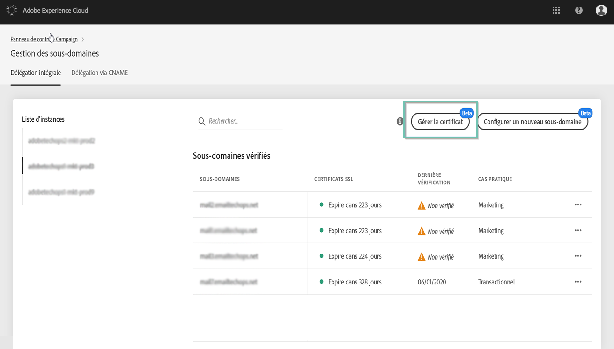
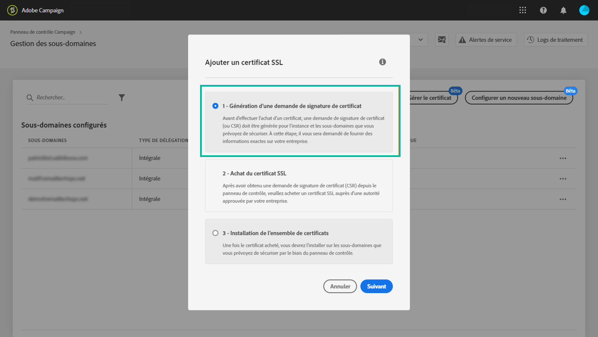
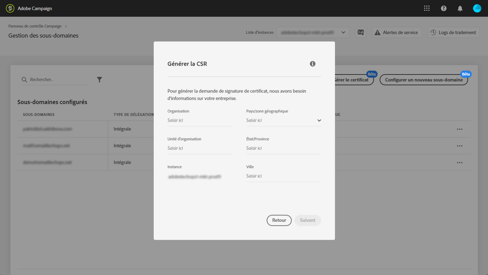
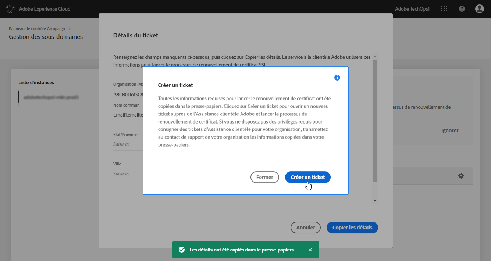
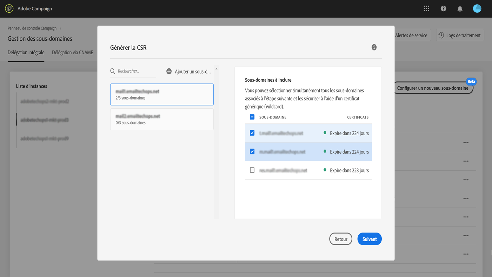
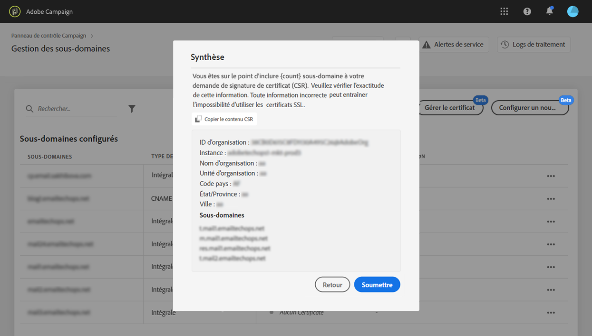
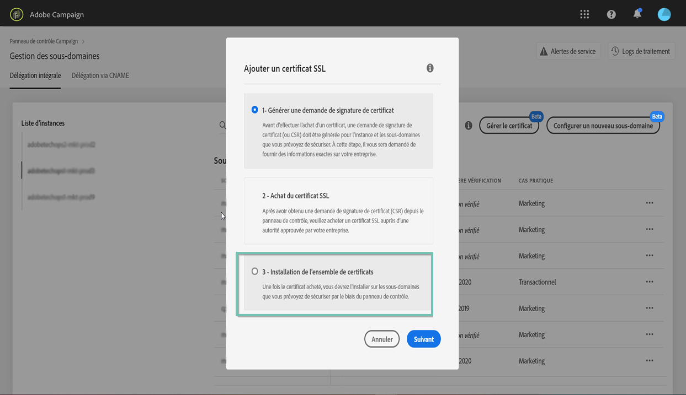
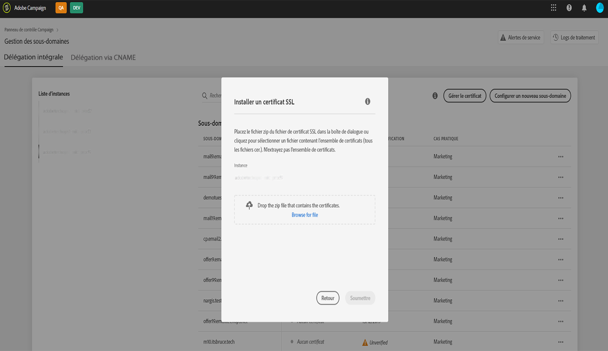

# Renouvellement du certificat SSL d’un sous-domaine {#renewing-subdomains-ssl-certificates}

>[!IMPORTANT]
>
>La délégation de sous-domaines du Panneau de configuration sera disponible en version bêta d&#39;ici la fin janvier et sujette à de fréquentes mises à jour et modifications sans préavis.

## A propos du renouvellement des certificats {#about-certificate-renewal-process}

La procédure de renouvellement des certificats SSL comprend 3 étapes :

1. **Génération de la demande de signature de certificat (CSR)**
Le service clientèle Adobe génère une demande de signature de certificat pour vous. Vous devrez fournir certaines informations nécessaires à la génération de la demande de signature de certificat (telles que le nom commun, le nom et l’adresse de l’organisation, etc.).
1. **Achat du certificat SSL**
Une fois la demande de signature de certificat générée, vous pouvez la télécharger et l’utiliser pour acheter le certificat SSL auprès de l’autorité de certification approuvée par votre entreprise.
1. **Installation du certificat SSL**
Une fois le certificat SSL acheté, vous pouvez l’installer sur le sous-domaine souhaité.

>[!NOTE]
>
>Le renouvellement des certificats SSL via le Panneau de configuration est disponible pour les sous-domaines **** entièrement délégués uniquement.

## Génération d’une demande de signature de certificat (CSR) {#generating-csr}

Pour générer une demande de signature de certificat (CSR), procédez comme suit :

1. Dans la carte **[!UICONTROL Sous-domaines et certificats]**, sélectionnez l’instance voulue, puis cliquez sur le bouton**[!UICONTROL  Gérer le certificat]**.

   

1. Sélectionnez **[!UICONTROL Générer une CSR]**, puis cliquez sur**[!UICONTROL  Suivant]** pour lancer l’assistant qui vous guidera tout au long du processus de génération de la demande de signature de certificat.

   

1. Un formulaire s&#39;affiche contenant tous les détails nécessaires à la génération de la demande de signature de certificat.

   Make sure you fill in the requested information fully and accurately, otherwise the certificate may not be renewed (contact your internal team, Security and IT teams if necessary), then click **[!UICONTROL Next]**.

   * **[!UICONTROL Organisation]**: nom officiel de l&#39;organisation.
   * **[!UICONTROL Groupe]**de l&#39;organisation : unité liée au sous-domaine (exemple : Marketing, IT).
   * **[!UICONTROL Instance]**(préremplie) : URL de l’instance Campaign associée au sous-domaine.
   

1. Sélectionnez les sous-domaines à inclure dans le fichier CSR, puis cliquez sur **[!UICONTROL OK]**.

   

1. Les sous-domaines sélectionnés s’affichent dans la liste. Pour chacun d’eux, sélectionnez les sous-domaines à inclure, puis cliquez sur **[!UICONTROL Suivant]**.

   

1. Un résumé des sous-domaines à inclure dans le fichier CSR s’affiche. Cliquez sur **[!UICONTROL Envoyer]**pour confirmer votre requête.

   

1. Le fichier .csr correspondant à votre sélection est généré et téléchargé automatiquement. Vous pouvez désormais l’utiliser pour acheter le certificat SSL auprès de l’autorité de certification approuvée par votre société.

## Achat d’un certificat avec la demande de signature de certificat {#purchasing-certificate}

Après obtention d’une demande de signature de certificat via le Panneau de contrôle, achetez un certificat SSL auprès d’une autorité de certification approuvée par votre société.

## Installation du certificat SSL {#installing-ssl-certificate}

Une fois le certificat SSL acheté, vous pouvez l’installer sur votre instance. Avant de poursuivre, assurez-vous de connaître les conditions préalables suivantes :

* La demande de signature de certificat (CSR) doit avoir été générée à partir du Panneau de configuration. Sinon, vous ne pourrez pas installer le certificat à partir du Panneau de configuration.
* Assurez-vous que la demande de signature de certificat (CSR) correspond au sous-domaine qui a été délégué à Adobe. Par exemple, il ne peut pas contenir plus de sous-domaines que celui qui a été délégué.
* Le certificat doit avoir une date actuelle. Il est impossible d’installer des certificats avec des dates dans le futur.

Pour installer le certificat, procédez comme suit :

1. Dans la carte **[!UICONTROL Sous-domaines et certificats]**, sélectionnez l’instance voulue, puis cliquez sur le bouton**[!UICONTROL  Gérer le certificat]**.

   

1. Cliquez sur **[!UICONTROL Installer le certificat SSL]**, puis sur**[!UICONTROL  Suivant]** pour lancer l’assistant qui vous guidera tout au long du processus d’installation du certificat.

   

1. Sélectionnez le fichier .zip contenant le certificat à installer, puis cliquez sur **[!UICONTROL Envoyer]**.

   

Une fois le certificat SSL installé, la date d’expiration et l’icône d’état du certificat sont mises à jour en conséquence.

L’adresse URL de votre sous-domaine passe de **http** à **https**.
