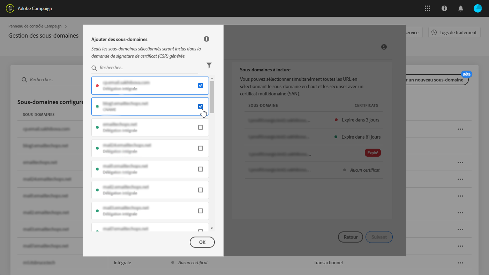
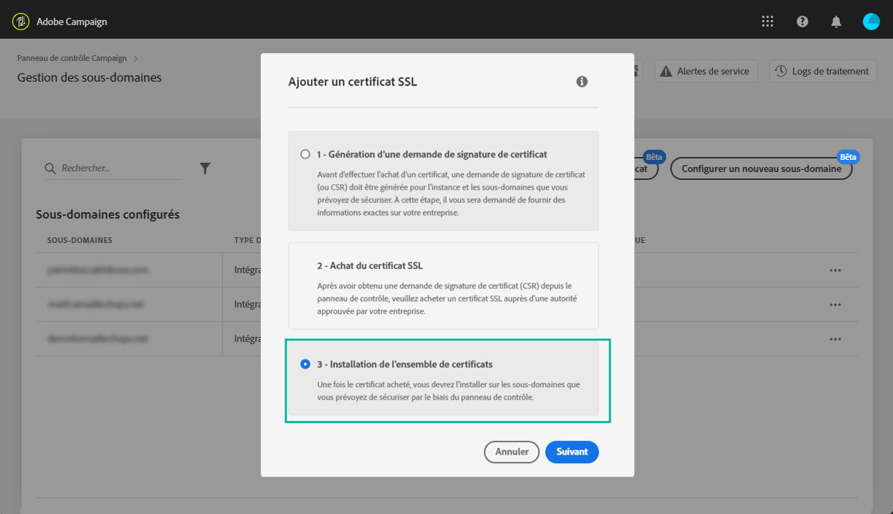

# Renouvellement du certificat SSL d’un sous-domaine {#renewing-subdomains-ssl-certificates}

>[!CONTEXTUALHELP]
>id="cp_add_ssl_certificate"
>title="Ajouter un certificat SSL"
>abstract="Pour ajouter un certificat SSL, vous devez générer une demande de signature de certificat (CSR), acheter le certificat SSL pour vos sous-domaines et installer le pack du certificat."
>additional-url="https://docs.adobe.com/content/help/fr-FR/control-panel/using/subdomains-and-certificates/renewing-subdomain-certificate.html#generating-csr" text="Génération d’une demande de signature de certificat (CSR)"
>additional-url="https://docs.adobe.com/content/help/fr-FR/control-panel/using/subdomains-and-certificates/renewing-subdomain-certificate.html#installing-ssl-certificate" text="Comment installer un certificat SSL"

## À propos du renouvellement des certificats {#about-certificate-renewal-process}

>[!IMPORTANT]
>
>La configuration de sous-domaine depuis le Panneau de contrôle est disponible en version bêta et sujette à de fréquentes mises à jour et modifications sans préavis.

La procédure de renouvellement des certificats SSL comprend 3 étapes :

1. **Génération de la demande de signature de certificat (CSR)**
L’Assistance clientèle Adobe génère une demande de signature de certificat pour vous. Vous devrez fournir certaines informations nécessaires à la génération de la demande de signature de certificat (telles que le nom commun, le nom et l’adresse de l’organisation, etc.).
1. **Achat du certificat SSL**
Une fois la demande de signature de certificat générée, vous pouvez la télécharger et l’utiliser pour acheter le certificat SSL auprès de l’autorité de certification approuvée par votre entreprise.
1. **Installation du certificat SSL**
Une fois le certificat SSL acheté, vous pouvez l’installer sur le sous-domaine souhaité.

 Découvrez cette fonctionnalité dans la vidéo à l&#39;aide d&#39;un [Campaign Classic](https://experienceleague.adobe.com/docs/campaign-classic-learn/control-panel/subdomains-and-certificates/adding-ssl-certificates.html?lang=en#subdomains-and-certificates) ou d&#39;un [Campaign Standard](https://experienceleague.adobe.com/docs/campaign-standard-learn/control-panel/subdomains-and-certificates/adding-ssl-certificates.html?lang=en#adding-ssl-certificates)

## Génération d’une demande de signature de certificat (CSR) {#generating-csr}

>[!CONTEXTUALHELP]
>id="cp_generate_csr"
>title="Générer la CSR"
>abstract="La demande de signature de certificat doit être générée pour l’instance et les sous-domaines que vous envisagez de sécuriser avant d’acheter un certificat."

>[!CONTEXTUALHELP]
>id="cp_select_subdomains"
>title="Sélectionner les sous-domaines pour votre CSR"
>abstract="Vous pouvez choisir d’inclure tous les sous-domaines ou uniquement des sous-domaines spécifiques dans votre demande de signature de certificat. Seuls les sous-domaines sélectionnés seront certifiés par le biais du certificat SSL acheté."
>additional-url="https://docs.adobe.com/content/help/fr-FR/control-panel/using/subdomains-and-certificates/renewing-subdomain-certificate.html#generating-csr" text="Génération d’une demande de signature de certificat (CSR)"
>additional-url="https://docs.adobe.com/content/help/fr-FR/control-panel/using/subdomains-and-certificates/subdomains-branding.html" text="À propos de la marque des sous-domaines"

Pour générer une demande de signature de certificat (CSR), procédez comme suit :

1. Dans la carte **[!UICONTROL Sous-domaines et certificats]**, sélectionnez l’instance voulue, puis cliquez sur le bouton **[!UICONTROL Gérer le certificat]**.

   

1. Sélectionnez **[!UICONTROL 1 - Génération d’une demande de signature de certificat]**, puis cliquez sur **[!UICONTROL Suivant]** pour lancer l’assistant qui vous guidera tout au long du processus de génération de la demande de signature de certificat.

   

1. Un formulaire s’affiche contenant tous les détails nécessaires à la génération de la demande de signature de certificat.

   Veillez à renseigner précisément les informations demandées, faute de quoi il est possible que le certificat ne soit pas renouvelé (contactez votre équipe interne et les équipes de sécurité et informatique si nécessaire), puis cliquez sur **[!UICONTROL Suivant]**.

   * **[!UICONTROL Organisation]** : nom officiel de l’organisation.
   * **[!UICONTROL Unité d’organisation]** : unité associée au sous-domaine (exemple : marketing, informatique).
   * **[!UICONTROL Instance]** (prérenseigné) : URL de l’instance Campaign associée au sous-domaine.

   

1. Sélectionnez les sous-domaines à inclure dans le fichier CSR, puis cliquez sur **[!UICONTROL OK]**.

   

1. Les sous-domaines sélectionnés s’affichent dans la liste. Pour chacun d’eux, sélectionnez les sous-domaines à inclure, puis cliquez sur **[!UICONTROL Suivant]**.

   

1. Un résumé des sous-domaines à inclure dans le fichier CSR s’affiche. Cliquez sur **[!UICONTROL Soumettre]** pour confirmer votre requête.

   

1. Le fichier .csr correspondant à votre sélection est généré et téléchargé automatiquement. Vous pouvez désormais l’utiliser pour acheter le certificat SSL auprès de l’autorité de certification approuvée par votre société.

   >[!NOTE]
   >
   >Si le fichier CSR n’est pas enregistré/téléchargé, il sera perdu et vous devrez le générer de nouveau.

## Achat d’un certificat avec la demande de signature de certificat {#purchasing-certificate}

Après obtention d’une demande de signature de certificat via le panneau de contrôle, achetez un certificat SSL auprès d’une autorité de certification approuvée par votre société.

## Installation du certificat SSL {#installing-ssl-certificate}

>[!CONTEXTUALHELP]
>id="cp_install_ssl_certificate"
>title="Installer un certificat SSL"
>abstract="Installez le certificat SSL que vous avez acheté auprès de l’autorité de certification approuvée par votre entreprise."
>additional-url="https://docs.adobe.com/content/help/fr-FR/control-panel/using/subdomains-and-certificates/subdomains-branding.html" text="À propos de la marque des sous-domaines"

Une fois un certificat SSL acheté, vous pouvez l’installer sur votre instance. Avant de poursuivre, prenez connaissance des prérequis suivants :

* La demande de signature de certificat (CSR) doit avoir été générée depuis le panneau de contrôle. Sinon, vous ne pourrez pas installer le certificat depuis le panneau de contrôle.
* La demande de signature de certificat (CSR) doit correspondre au sous-domaine qui a été configuré pour fonctionner avec Adobe. Par exemple, elle ne peut pas contenir d’autres sous-domaines que celui qui a été configuré.
* La date du certificat doit être celle en cours. Il n’est pas possible d’installer des certificats avec des dates dans le futur ou ayant expiré (les dates de début et de fin doivent être valides).
* Le certificat doit être émis par une autorité de certification approuvée telle que Comodo, DigiCert, GoDaddy, etc.
* La taille du certificat doit être de 2 048 bits et l’algorithme doit être de type RSA.
* Le certificat doit être au format X.509 PEM.
* Les certificats SAN sont pris en charge.
* Les certificats génériques ne sont pas pris en charge.
* Le fichier ZIP ou le certificat ne doit pas être protégé par mot de passe.
* Le fichier ZIP ne doit contenir que les éléments suivants, de préférence dans des fichiers séparés :
   * Certificat d’entité finale.
   * Chaîne de certificats intermédiaires (organisée dans le bon ordre).
   * Certificat racine (facultatif).

Pour installer le certificat, procédez comme suit :

1. Dans la carte **[!UICONTROL Sous-domaines et certificats]**, sélectionnez l’instance voulue, puis cliquez sur le bouton **[!UICONTROL Gérer le certificat]**.

   

1. Sélectionnez **[!UICONTROL 3 - Installation de l’ensemble de certificats]**, puis cliquez sur **[!UICONTROL Suivant]** pour lancer l’assistant qui vous guidera tout au long du processus d’installation du certificat.

   

1. Sélectionnez le fichier .zip contenant le certificat à installer, puis cliquez sur **[!UICONTROL Soumettre]**.

   

>[!NOTE]
>
>Le certificat sera installé sur tous les domaines/sous-domaines inclus dans la demande de signature de certificat (CSR). Aucun domaine/sous-domaine supplémentaire indiqué dans le certificat ne sera pris en compte.

Une fois le certificat SSL installé, sa date d’expiration et son icône d’état sont mises à jour.

**Rubriques connexes :**

* [Marque des sous-domaines](../../subdomains-certificates/using/subdomains-branding.md)
* [Surveillance de vos sous-domaines](../../subdomains-certificates/using/monitoring-subdomains.md)