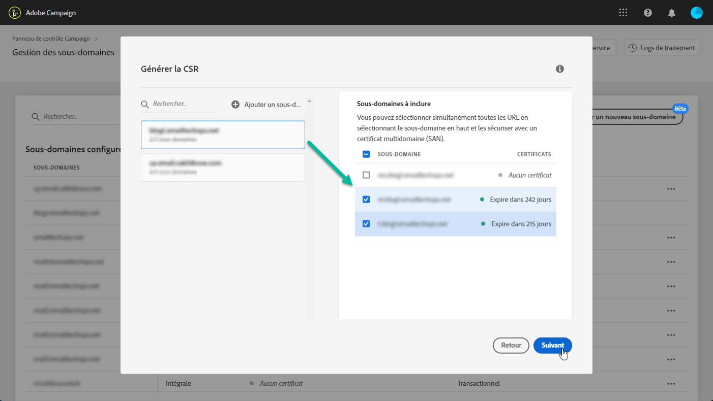
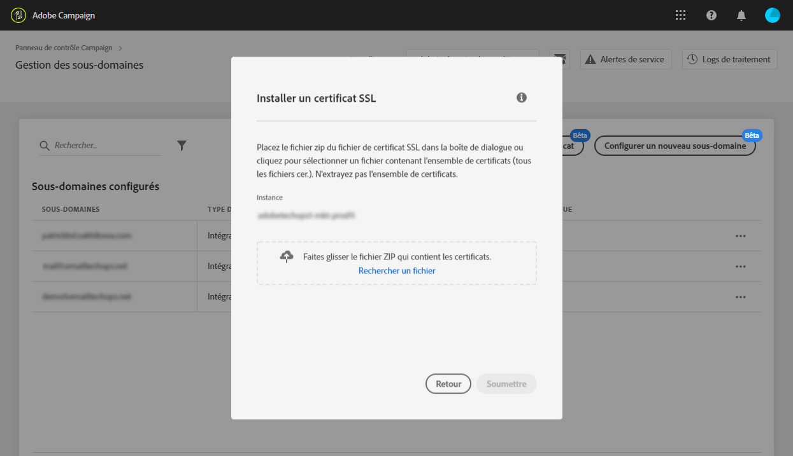

# Renouvellement du certificat SSL d’un sous-domaine {#renewing-subdomains-ssl-certificates}

>[!NOTE]
>
>La délégation de sous-domaines du Panneau de configuration est actuellement en version bêta et sujette à de fréquentes mises à jour et modifications sans notification.

## A propos du renouvellement des certificats {#about-certificate-renewal-process}

La procédure de renouvellement des certificats SSL comprend 3 étapes :

1. **Génération de la demande de signature de certificat (CSR) Le service à la clientèle** Adobe génère une demande de signature de certificat pour vous. Vous devrez fournir certaines informations nécessaires à la génération de la demande de signature de certificat (telles que le nom commun, le nom et l’adresse de l’organisation, etc.).
1. **Achat du certificat** SSL Une fois le fichier CSR généré, vous pouvez le télécharger et l’utiliser pour acheter le certificat SSL auprès de l’autorité de certification approuvée par votre société.
1. **Installation du certificat** SSL Une fois le certificat SSL acheté, vous pouvez l’installer sur le sous-domaine souhaité.

>[!NOTE]
>
>Le renouvellement des certificats SSL via le Panneau de configuration est disponible pour les sous-domaines **** entièrement délégués uniquement.

## Génération d’une demande de signature de certificat (CSR) {#generating-csr}

Pour générer une demande de signature de certificat (CSR), procédez comme suit :

1. Dans la carte **[!UICONTROL Sous-domaines et certificats]**, sélectionnez une instance, puis cliquez sur le bouton**[!UICONTROL  Gérer le certificat]** .

   

1. Sélectionnez **[!UICONTROL Générer une CSR]**, puis cliquez sur**[!UICONTROL  Suivant]** pour lancer l’assistant qui vous guidera tout au long du processus de génération de CSR.

   

1. Un formulaire s’affiche, avec tous les détails nécessaires pour générer votre CSR.

   Veillez à renseigner les informations demandées de manière complète et précise, sinon le certificat ne sera pas renouvelé (contactez votre équipe interne, les équipes Sécurité et Informatique si nécessaire), puis cliquez sur **[!UICONTROL Suivant]**.

   * **[!UICONTROL Organisation]**: nom officiel de l’organisation.
   * **[!UICONTROL Groupe]**de l&#39;organisation : unité liée au sous-domaine (exemple : Marketing, IT).
   * **[!UICONTROL Instance]**(préremplie) : URL de l’instance Campaign associée au sous-domaine.
   

1. Sélectionnez les sous-domaines à inclure dans le fichier CSR, puis cliquez sur **[!UICONTROL OK]**.

   

1. Les sous-domaines sélectionnés s’affichent dans la liste. Pour chacun d’eux, sélectionnez les sous-domaines à inclure, puis cliquez sur **[!UICONTROL Suivant]**.

   

1. Un résumé des sous-domaines à inclure dans le fichier CSR s’affiche. Cliquez sur **[!UICONTROL Envoyer]**pour confirmer votre requête.

   

1. Le fichier .csr correspondant à votre sélection est généré et téléchargé automatiquement. Vous pouvez désormais l’utiliser pour acheter le certificat SSL auprès de l’autorité de certification approuvée par votre société.

## Achat d’un certificat avec le CSR {#purchasing-certificate}

Après avoir obtenu une demande de signature de certificat CSR auprès du Panneau de configuration, achetez un certificat SSL auprès d’une autorité de certification approuvée par votre organisation.

## Installation du certificat SSL {#installing-ssl-certificate}

Une fois le certificat SSL acheté, vous pouvez l’installer sur votre instance. Avant de poursuivre, assurez-vous de connaître les conditions préalables suivantes :

* La demande de signature de certificat (CSR) doit avoir été générée à partir du Panneau de configuration. Sinon, vous ne pourrez pas installer le certificat à partir du Panneau de configuration.
* Assurez-vous que la demande de signature de certificat (CSR) correspond au sous-domaine qui a été délégué à Adobe. Par exemple, il ne peut pas contenir plus de sous-domaines que celui qui a été délégué.
* Le certificat doit avoir une date actuelle. Il est impossible d’installer des certificats avec des dates dans le futur.

Pour installer le certificat, procédez comme suit :

1. Dans la carte **[!UICONTROL Sous-domaines et certificats]**, sélectionnez une instance, puis cliquez sur le bouton**[!UICONTROL  Gérer le certificat]** .

   

1. Cliquez sur **[!UICONTROL Installer le certificat]**SSL, puis sur**[!UICONTROL  Suivant]** pour lancer l’assistant qui vous guidera tout au long du processus d’installation du certificat.

   

1. Sélectionnez le fichier .zip contenant le certificat à installer, puis cliquez sur **[!UICONTROL Envoyer]**.

   

Une fois le certificat SSL installé, la date d’expiration et l’icône d’état du certificat sont mises à jour en conséquence.

L’adresse URL de votre sous-domaine passe de **http** à **https**.
