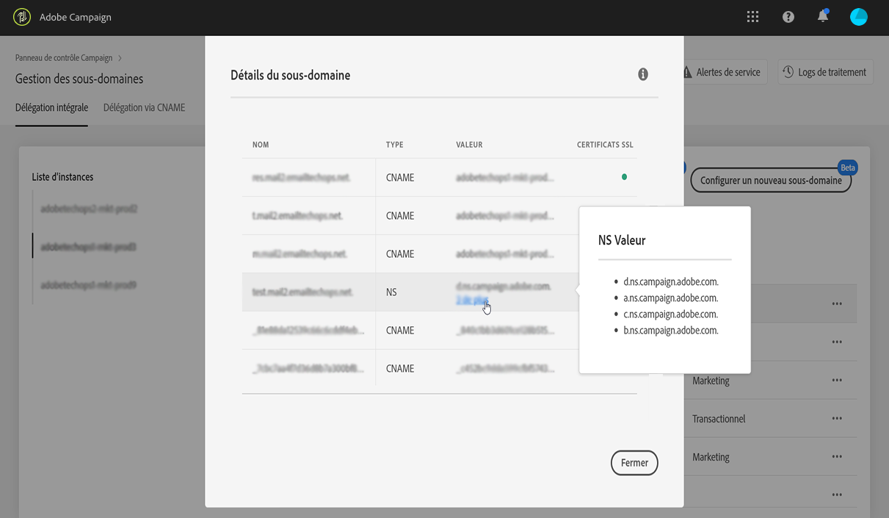
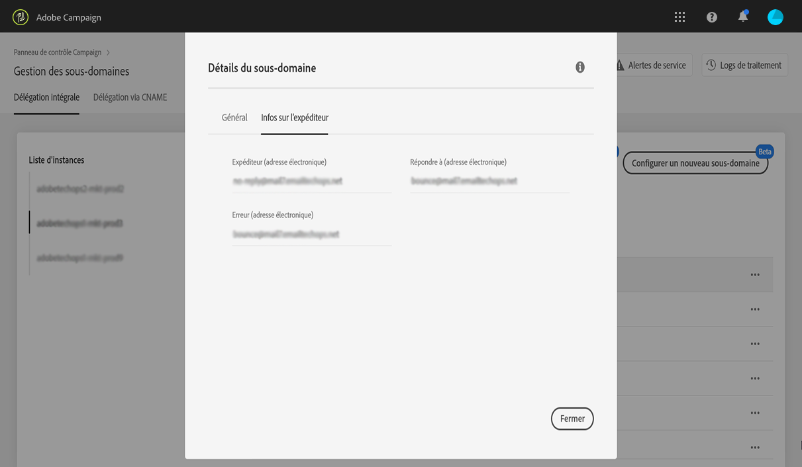

# Configuration d’un nouveau sous-domaine {#setting-up-subdomain}

>[!CONTEXTUALHELP]
>id=&quot;cp_subdomain_management&quot;
>title=&quot;Configurer de nouveaux sous-domaines et gérer les certificats&quot;
>abstract=&quot;Vous devez configurer un nouveau sous-domaine et gérer les certificats SSL de vos sous-domaines pour envoyer des emails ou publier des landing pages avec Adobe Campaign.&quot;
>additional-url=&quot;https://docs.adobe.com/content/help/fr-FR/control-panel/using/subdomains-and-certificates/monitoring-ssl-certificates.html&quot; text=&quot;Surveiller les certificats SSL de vos sous-domaines&quot;

>[!IMPORTANT]
>
>La délégation de sous-domaine depuis le panneau de contrôle est disponible en version bêta et sujette à de fréquentes mises à jour et modifications sans préavis.

## Délégation complète de sous-domaine {#full-subdomain-delegation}

Le panneau de contrôle vous permet de déléguer entièrement un sous-domaine à Adobe Campaign. Pour ce faire, suivez les étapes ci-après.

>[!NOTE]
>
>Si l’instance sélectionnée ne comporte aucun sous-domaine configuré, le premier sous-domaine délégué à Adobe deviendra le **sous-domaine principal** de cette instance. Vous ne pourrez plus le modifier à l’avenir.
>
>Des enregistrements DNS inversés seront créés pour d’autres sous-domaines utilisant le sous-domaine principal. Les adresses de réponse et bounce pour les autres sous-domaines seront générées à partir du sous-domaine principal.

1. Dans la **[!UICONTROL Subdomains & Certificates]** carte, sélectionnez l’instance de production souhaitée, puis cliquez sur **[!UICONTROL Setup new subdomain]**.

   

   >[!NOTE]
   >
   >La délégation de sous-domaine n’est disponible que pour les instances de **production**.

1. Click **[!UICONTROL Next]** to confirm the full delegation method.

   

   >[!NOTE]
   >
   >Les méthodes [CNAME](#use-cnames) et personnalisées ne sont actuellement pas prises en charge par le panneau de contrôle.

1. Créez le sous-domaine et les serveurs de noms souhaités dans la solution d’hébergement utilisée par votre entreprise. Pour ce faire, copiez et collez les informations du serveur de noms Adobe affichées dans l’assistant. Pour plus d’informations sur la création d’un sous-domaine dans une solution d’hébergement, reportez-vous à ce [tutoriel vidéo](https://video.tv.adobe.com/v/30175?captions=fre_fr).

   >[!IMPORTANT]
   >
   >Lors de la configuration des serveurs de noms, veillez à **ne jamais déléguer votre sous-domaine racine à Adobe**. Sinon, le domaine ne pourra fonctionner qu’avec Adobe. Toute autre utilisation sera impossible, comme par exemple envoyer des emails internes aux employés de votre entreprise.
   >
   >De plus, **ne créez pas de fichier** de zone distinct pour ce nouveau sous-domaine.

   

   Once the subdomain is created with the corresponding Adobe nameserver information, click **[!UICONTROL Next]**.

1. Sélectionnez le cas d’utilisation souhaité pour le sous-domaine :

   * **Communications marketing** : communications destinées à un usage commercial. Exemple : campagne par email de vente.
   * **Communications transactionnelles et opérationnelles** : les communications transactionnelles contiennent des informations visant à terminer un processus que le destinataire a commencé avec vous. Exemple : confirmation d’achat, email de réinitialisation de mot de passe. Les communications organisationnelles se rapportent à l’échange d’informations, d’idées et d’opinions au sein et à l’extérieur de l’organisation, sans but commercial.
   

   **La ventilation de vos sous-domaines selon les cas d’utilisation est une bonne pratique en matière de délivrabilité**. Elle permet d’isoler et de protéger la réputation de chaque sous-domaine. Par exemple, si votre sous-domaine de communications marketing est placé sur liste noire par les fournisseurs de services Internet, votre sous-domaine de communications transactionnelles ne sera pas affecté et pourra encore envoyer des communications.

   **Vous pouvez déléguer un sous-domaine pour les cas** d’utilisation Marketing et Transactionnel :

   * Pour les cas d’utilisation Marketing, les sous-domaines seront configurés sur les instances **MID** (Mid sourcing).
   * Pour les cas d’utilisation transactionnelle, les sous-domaines seront configurés sur TOUTES les instances **RT** (Centre de messages / messagerie en temps réel) afin d’assurer la connectivité. Les sous-domaines fonctionneront donc avec toutes vos instances RT.
   >[!NOTE]
   >
   >Si vous utilisez Campaign Classic, le Panneau de configuration vous permet de voir quelles instances RT/MID sont connectées à l’instance Marketing avec laquelle vous travaillez. Voir à ce propos [cette section](../../instances-settings/using/instance-details.md).

1. Enter the subdomain that you created into your hosting solution, then click **[!UICONTROL Submit]**.

   Veillez à indiquer le **nom complet** du sous-domaine à déléguer. Par exemple, pour déléguer le sous-domaine « usoffers.email.weretail.com », saisissez « usoffers.email.weretail.com ».

   

1. Une fois le sous-domaine envoyé, le panneau de contrôle vérifie qu’il pointe correctement vers les enregistrements NS Adobe et que l’enregistrement Start of Authority (SOA) n’existe pas pour ce sous-domaine.

1. Si les vérifications réussissent, le panneau de contrôle commence à configurer le sous-domaine avec des enregistrements DNS, des URL supplémentaires, des boîtes de réception, etc. You can get more details on the configuration progress by clicking the **[!UICONTROL Process details]** button.

   

   >[!NOTE]
   >
   >Dans certains cas, la délégation est effectuée, mais pas la vérification du sous-domaine. The subdomain will go directly into the **[!UICONTROL Verified subdomains]** list with the **[!UICONTROL Unverified]** status and a job log providing information on the error. Contactez l’Assistance clientèle si vous avez des difficultés à résoudre le problème.
   >
   >Pendant l’exécution de la délégation de sous-domaine, d’autres requêtes effectuées via le panneau de contrôle seront mises en file d’attente et exécutées uniquement une fois la délégation de sous-domaine terminée. Cela permet d’éviter tout problème de performances.

À la fin du processus, les sous-domaines sont configurés pour fonctionner avec votre instance Adobe Campaign et les éléments suivants sont créés :

* **Le sous-domaine** avec les **enregistrements DNS** suivants : SOA, MX, CNAME, DKIM, SPF et TXT
* **Des sous-domaines supplémentaires** pour héberger les pages miroir, de ressources et de tracking, ainsi que la clé de domaine
* **Des boîtes de réception** : Expéditeur, Erreur, Réponse

>[!NOTE]
>
>Par défaut, la boîte de réception « Réponse » du panneau de contrôle est configurée pour effacer les emails et ne peut pas être examinée. Si vous souhaitez surveiller votre boîte de réception « Réponse » pour vos campagnes marketing, n’utilisez pas cette adresse.

You can get more details on the subdomain by clicking the **[!UICONTROL Subdomain Details]** button.

>[!IMPORTANT]
>
>Suite à l’étape de traitement, vous devez vérifier auprès de l’Assistance clientèle Adobe qu’une demande de vérification a été déposée afin que l’équipe de délivrabilité vérifie le nouveau sous-domaine créé. Le processus de vérification peut prendre 3 à 10 jours ouvrables après la délégation du sous-domaine.
>
>Les contrôles effectués comprennent les tests de feedback loops et de boucles de plaintes relatives au spam. Nous vous déconseillons donc d’utiliser le sous-domaine avant la fin de la vérification, car cela pourrait entraîner une mauvaise réputation du sous-domaine.

## Utilisation des CNAME {#use-cnames}

L’utilisation des CNAME pour la délégation de sous-domaine n’est pas prise en charge par le panneau de contrôle. Pour utiliser cette méthode, contactez l’Assistance clientèle Adobe.

**Rubriques connexes :**

* [Délégation de sous-domaines (tutoriel vidéo)](https://docs.adobe.com/content/help/en/campaign-learn/campaign-standard-tutorials/administrating/control-panel/subdomain-delegation.html)
* [Marque des sous-domaines](../../subdomains-certificates/using/subdomains-branding.md)
* [Surveillance de vos sous-domaines](../../subdomains-certificates/using/monitoring-subdomains.md)