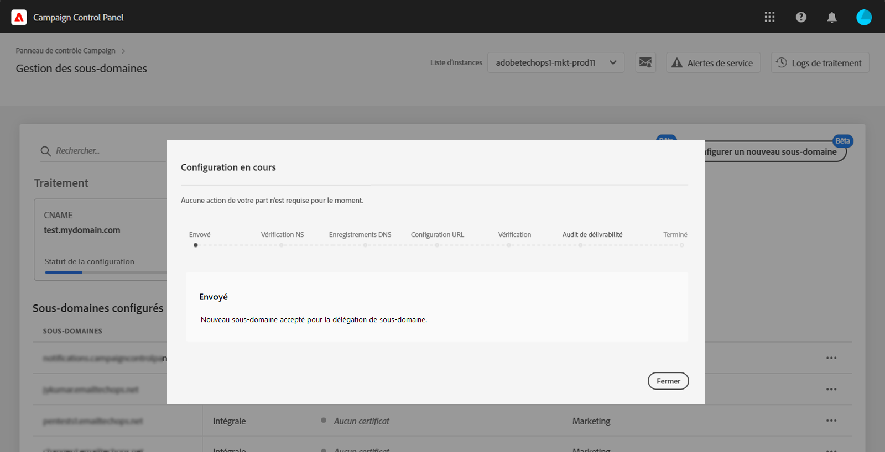

# Configuration d’un nouveau sous-domaine {#setting-up-subdomain}

>[!CONTEXTUALHELP]
>id="cp_subdomain_management"
>title="Configurer de nouveaux sous-domaines et gérer les certificats"
>abstract="Vous devez configurer un nouveau sous-domaine et gérer les certificats SSL de vos sous-domaines pour envoyer des emails ou publier des landing pages avec Adobe Campaign."
>additional-url="https://docs.adobe.com/content/help/fr-FR/control-panel/using/subdomains-and-certificates/monitoring-ssl-certificates.html" text="Comment surveiller les certificats SSL de vos sous-domaines"

## À lire absolument {#must-read}

>[!IMPORTANT]
>
>La configuration de sous-domaine depuis le Panneau de contrôle est disponible en version bêta et sujette à de fréquentes mises à jour et modifications sans préavis.

Cette page fournit des informations sur la configuration de nouveaux sous-domaines à l’aide de la délégation complète de sous-domaine ou de CNAME. Global concepts on these two methods are presented in this section: [Subdomains branding](../../subdomains-certificates/using/subdomains-branding.md).

**Rubrique connexe :**

* [Surveillance de vos sous-domaines](../../subdomains-certificates/using/monitoring-subdomains.md)

### Sélection d’une instance

La configuration de sous-domaine n’est disponible que pour les instances de **production**.

Si l’instance sélectionnée dans l’assistant ne comporte aucun sous-domaine configuré précédemment, le premier sous-domaine configuré deviendra le **sous-domaine principal** pour cette instance et vous ne pourrez plus le modifier par la suite.

Des **enregistrements DNS inversés** seront créés pour d’autres sous-domaines utilisant ce sous-domaine principal. **Les adresses de réponse et bounce pour les autres sous-domaines seront générées à partir du sous-domaine principal.**

### Configuration des serveurs de noms

Lors de la configuration des serveurs de noms, veillez à **ne jamais déléguer votre sous-domaine racine à Adobe**. Sinon, le domaine ne pourra fonctionner qu’avec Adobe. Toute autre utilisation sera impossible, comme par exemple envoyer des emails internes aux employés de votre entreprise.

De plus, **ne créez pas de fichier de zone distinct** pour ce nouveau sous-domaine.

## Délégation complète de sous-domaine {#full-subdomain-delegation}

Pour déléguer complètement un sous-domaine à Adobe Campaign, procédez comme suit.

 Découvrez cette fonctionnalité dans la vidéo à l&#39;aide d&#39;un [Campaign Classic](https://experienceleague.adobe.com/docs/campaign-classic-learn/control-panel/subdomains-and-certificates/subdomain-delegation.html?lang=en#subdomains-and-certificates) ou d&#39;un [Campaign Standard](https://experienceleague.adobe.com/docs/campaign-standard-learn/control-panel/subdomains-and-certificates/subdomain-delegation.html?lang=en#subdomains-and-certificates)

1. Dans la carte **[!UICONTROL Sous-domaines et certificats]**, sélectionnez l’instance de production souhaitée, puis cliquez sur **[!UICONTROL Configurer un nouveau sous-domaine]**.

   

1. Cliquez sur **[!UICONTROL Suivant]** pour confirmer votre choix de la méthode de délégation complète.

   

1. Créez le sous-domaine et les serveurs de noms souhaités dans la solution d’hébergement utilisée par votre entreprise. Pour ce faire, copiez et collez les informations du serveur de noms Adobe affichées dans l’assistant. Pour plus d’informations sur la création d’un sous-domaine dans une solution d’hébergement, reportez-vous à ce [tutoriel vidéo](https://video.tv.adobe.com/v/30175?captions=fre_fr).

   

1. Une fois le sous-domaine créé avec les informations du serveur de noms Adobe correspondantes, cliquez sur **[!UICONTROL Suivant]**.

1. Si vous avez sélectionné une instance de Campaign Classic, sélectionnez le cas d’utilisation souhaité pour le sous-domaine : **Communications marketing** ou **Communications transactionnelles et opérationnelles**. Les concepts globaux relatifs aux cas d’utilisation des sous-domaines sont présentés dans [cette section](../../subdomains-certificates/using/subdomains-branding.md#about-subdomains-use-cases).

   

1. Entrez le sous-domaine que vous avez créé dans votre solution d’hébergement, puis cliquez sur **[!UICONTROL Soumettre]**.

   Veillez à indiquer le **nom complet** du sous-domaine à déléguer. Par exemple, pour déléguer le sous-domaine « usoffers.email.weretail.com », saisissez « usoffers.email.weretail.com ».

   

Une fois le sous-domaine soumis, le Panneau de Contrôle procède à différents contrôles et étapes de configuration. Pour plus d&#39;informations sur ce sujet, reportez-vous à la section Vérification et configuration [des](#subdomain-checks-and-configuration)sous-domaines.

## Configuration de sous-domaines à l’aide de CNAME {#use-cnames}

Pour configurer un sous-domaine à l’aide de CNAME, procédez comme décrit ci-dessous.

 Découvrez cette fonctionnalité dans la vidéo à l&#39;aide d&#39;un [Campaign Classic](https://experienceleague.adobe.com/docs/campaign-classic-learn/control-panel/subdomains-and-certificates/delegating-subdomains-using-cname.html?lang=en#subdomains-and-certificates) ou d&#39;un [Campaign Standard](https://experienceleague.adobe.com/docs/campaign-standard-learn/control-panel/subdomains-and-certificates/delegating-subdomains-using-cname.html?lang=en)

1. Dans la carte **[!UICONTROL Sous-domaines et certificats]**, sélectionnez l’instance de production souhaitée, puis cliquez sur **[!UICONTROL Configurer un nouveau sous-domaine]**.

   

1. Sélectionnez la méthode **[!UICONTROL CNAME]**, puis cliquez sur **[!UICONTROL Suivant]**.

   

1. Si vous avez sélectionné une instance de Campaign Classic, sélectionnez le cas d’utilisation souhaité pour le sous-domaine : **Communications marketing** ou **Communications transactionnelles et opérationnelles**. Les concepts globaux relatifs aux cas d’utilisation des sous-domaines sont présentés dans [cette section](../../subdomains-certificates/using/subdomains-branding.md#about-subdomains-use-cases).

   

1. Entrez le sous-domaine que vous avez créé dans votre solution d’hébergement, puis cliquez sur **[!UICONTROL Suivant]**.

   Veillez à indiquer le **nom complet** du sous-domaine à configurer. Par exemple, pour configurer le sous-domaine « usoffers.email.weretail.com », saisissez « usoffers.email.weretail.com ».

   

1. La liste des enregistrements à placer dans les serveurs DNS s’affiche. Copiez ces enregistrements un par un ou en téléchargeant un fichier CSV, puis accédez à votre solution d’hébergement de domaine pour générer les enregistrements DNS correspondants.

   

1. Assurez-vous que tous les enregistrements DNS des étapes précédentes ont été générés dans votre solution d’hébergement de domaine. Si tout est correctement configuré, sélectionnez la première instruction, puis cliquez sur **[!UICONTROL Soumettre]** pour confirmer.

   

   >[!NOTE]
   >
   >Si vous souhaitez créer les enregistrements et soumettre ultérieurement la configuration du sous-domaine, sélectionnez la deuxième instruction, puis cliquez sur **[!UICONTROL Soumettre ultérieurement]**. Vous pourrez ensuite reprendre la configuration du sous-domaine directement à partir de la zone de **[!UICONTROL traitement]** de l’écran de gestion des sous-domaines.
   >
   >Notez que les enregistrements DNS à placer dans votre serveur seront conservés par le Panneau de Contrôle pendant 30 jours. Au-delà de cette période, vous devrez configurer le sous-domaine à partir de zéro.

Une fois le sous-domaine soumis, le Panneau de Contrôle procède à différents contrôles et étapes de configuration. Pour plus d&#39;informations sur ce sujet, reportez-vous à la section Vérification et configuration [des](#subdomain-checks-and-configuration)sous-domaines.

## Vérifications et configuration des sous-domaines {#subdomain-checks-and-configuration}

1. Une fois le sous-domaine soumis, le Panneau de contrôle vérifie qu’il pointe correctement vers les enregistrements Adobe NS et que l’enregistrement Start of Authority (SOA) n’existe pas pour ce sous-domaine.

   >[!NOTE]
   >
   >Pendant l’exécution de la configuration de sous-domaine, d’autres requêtes effectuées via le Panneau de contrôle seront mises en file d’attente et exécutées uniquement une fois la configuration de sous-domaine terminée. Cela permet d’éviter tout problème de performances.

1. Si les vérifications réussissent, le panneau de contrôle commence à configurer le sous-domaine avec des enregistrements DNS, des URL supplémentaires, des boîtes de réception, etc.

   

   Pour afficher plus de détails sur la progression de la configuration, cliquez sur le bouton **[!UICONTROL Détails]** de la configuration de sous-domaine.

   

1. Enfin, l’**équipe chargée de la délivrabilité** sera informée du nouveau sous-domaine afin de le vérifier. Le processus de vérification peut prendre jusqu’à 10 jours ouvrables après la configuration du sous-domaine.

   >[!IMPORTANT]
   >
   >Les contrôles de délivrabilité effectués comprennent les tests de feedback loops et de boucles de plaintes relatives au spam. Nous vous déconseillons donc d’utiliser le sous-domaine avant la fin de la vérification, car cela pourrait entraîner une mauvaise réputation du sous-domaine.

1. À la fin du processus, les sous-domaines sont configurés pour fonctionner avec votre instance Adobe Campaign et les éléments suivants sont créés :

   * **Le sous-domaine avec les enregistrements DNS** suivants : SOA, MX, CNAME, DKIM, SPF et TXT
   * **Des sous-domaines supplémentaires** pour héberger les pages miroir, de ressources et de tracking, ainsi que la clé de domaine
   * **Des boîtes de réception** : Expéditeur, Erreur, Réponse

   Par défaut, la boîte de réception « Réponse » du panneau de contrôle est configurée pour effacer les emails et ne peut pas être examinée. Si vous souhaitez surveiller votre boîte de réception « Réponse » pour vos campagnes marketing, n’utilisez pas cette adresse.

Pour obtenir plus de détails sur un sous-domaine, cliquez sur le bouton **[!UICONTROL Détails du sous-domaine]** et **[!UICONTROL Infos sur l’expéditeur]**.

## Résolution des problèmes {#troubleshooting}

* Dans certains cas, la configuration du sous-domaine est effectuée, mais pas la vérification. Le sous-domaine reste dans la liste **[!UICONTROL Configuré]** avec un log de traitement contenant des informations sur l’erreur. Contactez l’Assistance clientèle si vous avez des difficultés à résoudre le problème.
* Si le sous-domaine est affiché comme « Non vérifié » après avoir été configuré, lancez une nouvelle vérification du sous-domaine (**...**/**[!UICONTROL Vérifier le sous-domaine]**). S’il affiche toujours le même statut, il se peut que le schéma des destinataires ait fait l’objet d’une personnalisation, ce qui ne peut pas être vérifié à l’aide de processus standard. Essayez d’envoyer une campagne avec ce sous-domaine.
* Si la configuration du sous-domaine prend trop de temps (plus de 10 jours ouvrés) à l’étape de l’audit de délivrabilité, contactez l’Assistance clientèle.
