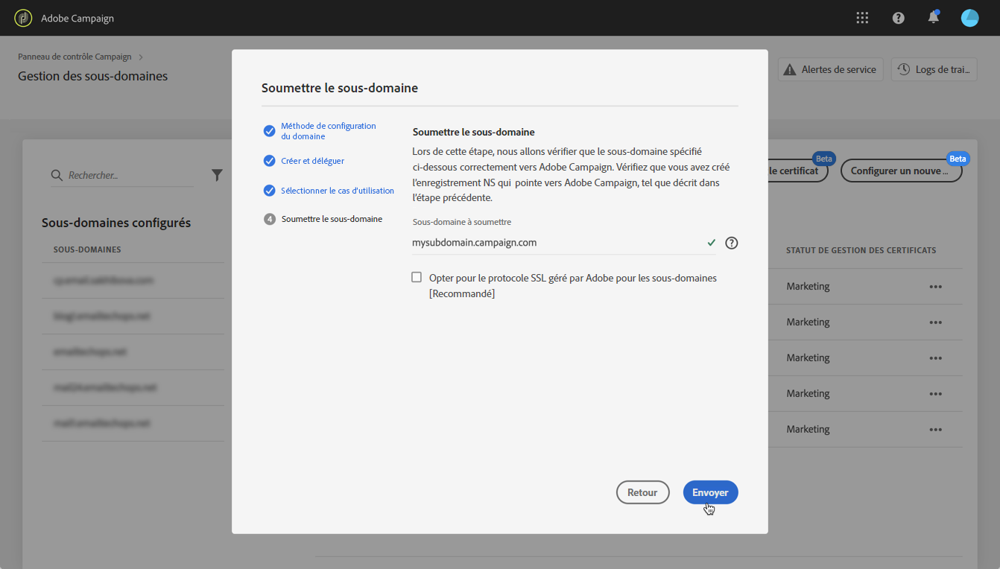
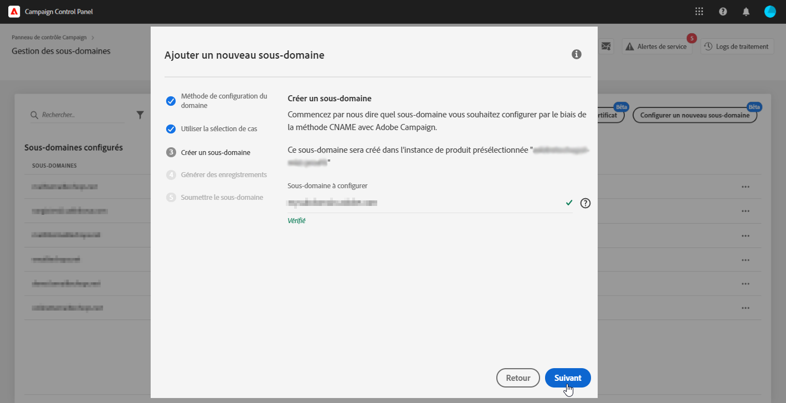

# Configuration d’un nouveau sous-domaine {#setting-up-subdomain}

>[!CONTEXTUALHELP]
>id="cp_subdomain_management"
>title="Configurer de nouveaux sous-domaines et gérer les certificats"
>abstract="Vous devez configurer un nouveau sous-domaine et gérer les certificats SSL de vos sous-domaines pour envoyer des emails ou publier des landing pages avec Adobe Campaign."
>additional-url="https://docs.adobe.com/content/help/fr-FR/control-panel/using/subdomains-and-certificates/monitoring-ssl-certificates.html" text="Comment surveiller les certificats SSL de vos sous-domaines"

>[!IMPORTANT]
>
>La configuration des sous-domaines à partir du Panneau de Contrôle est disponible en version bêta et sujette à de fréquentes mises à jour et modifications sans préavis.

Cette page fournit des informations sur la configuration de nouveaux sous-domaines à l’aide de la délégation de sous-domaines complète ou de CNAME. La présente section présente des concepts généraux de ces deux méthodes : .

**Rubriques connexes :**

* [Délégation de sous-domaines (tutoriel vidéo)](https://docs.adobe.com/content/help/en/campaign-learn/campaign-standard-tutorials/administrating/control-panel/subdomain-delegation.html)
* [Configuration de sous-domaines à l’aide de CNAME (vidéo de didacticiel)](https://docs.adobe.com/content/help/en/campaign-classic-learn/control-panel/subdomains-and-certificates/delegating-subdomains-using-cname.html)
* [Surveillance de vos sous-domaines](../../subdomains-certificates/using/monitoring-subdomains.md)

## À lire absolument {#must-read}

### Sélection d’instance

Subdomain configuration is available for **production** instances only.

Si l’instance que vous sélectionnez dans l’assistant ne comporte aucun sous-domaine précédemment configuré, le premier sous-domaine configuré deviendra le sous-domaine **** Principal pour cette instance et vous ne pourrez plus le modifier à l’avenir.

Par conséquent, des enregistrements **DNS** inversés seront créés pour d’autres sous-domaines utilisant ce sous-domaine Principal. **Les adresses de réponse et bounce pour les autres sous-domaines seront générées à partir du sous-domaine principal.**

### Configuration des serveurs de noms

Lors de la configuration des serveurs de noms, veillez à **ne jamais déléguer votre sous-domaine racine à Adobe**. Sinon, le domaine ne pourra fonctionner qu’avec Adobe. Toute autre utilisation sera impossible, comme par exemple envoyer des emails internes aux employés de votre entreprise.

De plus, **ne créez pas de fichier de zone distinct** pour ce nouveau sous-domaine.

## Délégation complète de sous-domaine {#full-subdomain-delegation}

Pour déléguer complètement un sous-domaine à l’Adobe Campaign, procédez comme suit :

1. Dans la carte **[!UICONTROL Sous-domaines et certificats]**, sélectionnez l’instance de production souhaitée, puis cliquez sur **[!UICONTROL Configurer un nouveau sous-domaine]**.

   

1. Cliquez sur **[!UICONTROL Suivant]** pour confirmer votre choix de la méthode de délégation complète.

   

1. Créez le sous-domaine et les serveurs de noms souhaités dans la solution d’hébergement utilisée par votre entreprise. Pour ce faire, copiez et collez les informations du serveur de noms Adobe affichées dans l’assistant. Pour plus d’informations sur la création d’un sous-domaine dans une solution d’hébergement, reportez-vous à ce [tutoriel vidéo](https://video.tv.adobe.com/v/30175?captions=fre_fr).

   

1. Une fois le sous-domaine créé avec les informations du serveur de noms Adobe correspondantes, cliquez sur **[!UICONTROL Suivant]**.

1. Si vous avez sélectionné une instance de Campaign Classic, sélectionnez la casse d’utilisation souhaitée pour le sous-domaine : **Communications** marketing ou communications **** transactionnelles et opérationnelles. Les concepts globaux relatifs aux cas d&#39;utilisation des sous-domaines sont présentés dans [cette section](../../subdomains-certificates/using/subdomains-branding.md#about-subdomains-use-cases).

   

1. Entrez le sous-domaine que vous avez créé dans votre solution d’hébergement, puis cliquez sur **[!UICONTROL Soumettre]**.

   Veillez à indiquer le **nom complet** du sous-domaine à déléguer. Par exemple, pour déléguer le sous-domaine « usoffers.email.weretail.com », saisissez « usoffers.email.weretail.com ».

   

Une fois le sous-domaine envoyé, le Panneau de Contrôle effectuera divers contrôles et étapes de configuration. Pour plus d&#39;informations sur ce sujet, reportez-vous à la section .

## Configuration de sous-domaines à l’aide de CNAME {#use-cnames}

Pour configurer un sous-domaine à l’aide de CNAME, procédez comme suit :

1. Dans la carte **[!UICONTROL Sous-domaines et certificats]**, sélectionnez l’instance de production souhaitée, puis cliquez sur **[!UICONTROL Configurer un nouveau sous-domaine]**.

   

1. Sélectionnez la méthode **[!UICONTROL CNAME]** , puis cliquez sur **[!UICONTROL Suivant]**.

   

1. Si vous avez sélectionné une instance de Campaign Classic, sélectionnez la casse d’utilisation souhaitée pour le sous-domaine : **Communications** marketing ou communications **** transactionnelles et opérationnelles. Les concepts globaux relatifs aux cas d&#39;utilisation des sous-domaines sont présentés dans [cette section](../../subdomains-certificates/using/subdomains-branding.md#about-subdomains-use-cases).

   

1. Enter the subdomain that you created into your hosting solution, then click **[!UICONTROL Next]**.

   Make sure you fill in the **full name** of the subdomain to setup. Par exemple, pour configurer le sous-domaine &quot;usoffres.email.weretail.com&quot;, saisissez &quot;usoffres.email.weretail.com&quot;.

   

1. La liste des enregistrements à placer sur les serveurs DNS s&#39;affiche. Copiez ces enregistrements un par un ou en téléchargeant un fichier CSV, puis accédez à votre solution d’hébergement de domaine pour générer les enregistrements DNS correspondants.

   

1. Assurez-vous que tous les enregistrements DNS des étapes précédentes ont été générés dans votre solution d’hébergement de domaine. Si tout est correctement configuré, sélectionnez la première instruction, puis cliquez sur **[!UICONTROL Envoyer]** pour confirmer.

   

   >[!NOTE]
   >
   >Si vous souhaitez créer les enregistrements et soumettre ultérieurement la configuration du sous-domaine, sélectionnez la deuxième instruction, puis cliquez sur **[!UICONTROL Envoyer plus tard]**. Vous pourrez ensuite reprendre la configuration du sous-domaine directement à partir de la zone de **[!UICONTROL traitement]** de l’écran de gestion des sous-domaines.
   >
   >Notez que les enregistrements DNS à placer sur votre serveur seront conservés d&#39;ici le Panneau de Contrôle 30 jours. Au-delà de cette période, vous devrez configurer le sous-domaine à partir de zéro.

Une fois le sous-domaine envoyé, le Panneau de Contrôle effectuera divers contrôles et étapes de configuration. Pour plus d’informations à ce sujet, voir .

## Vérifications et configuration des sous-domaines {#subdomain-checks-and-configuration}

1. Une fois qu&#39;un sous-domaine a été envoyé, le Panneau de Contrôle vérifie qu&#39;il pointe correctement vers les enregistrements NS de l&#39;Adobe et que l&#39;enregistrement SOA (Début of Authority) n&#39;existe pas pour ce sous-domaine.

   >[!NOTE]
   >
   >Notez que pendant l’exécution de la configuration du sous-domaine, d’autres requêtes via le Panneau de Contrôle seront entrées dans une file d’attente et exécutées uniquement après la configuration du sous-domaine, afin d’éviter tout problème de performances.

1. Si les vérifications réussissent, le panneau de contrôle commence à configurer le sous-domaine avec des enregistrements DNS, des URL supplémentaires, des boîtes de réception, etc.

   

   You can get more details on the configuration progress by clicking the subdomain configuration **[!UICONTROL Details]** button.

   

1. Enfin, l’**équipe chargée de la délivrabilité** sera informée du nouveau sous-domaine afin de le vérifier. Le processus d’audit peut prendre jusqu’à 10 jours ouvrés après la configuration du sous-domaine.

   >[!IMPORTANT]
   >
   >Les contrôles de délivrabilité effectués comprennent les boucles de rétroaction et les tests de boucles de plaintes de spam. Nous vous déconseillons donc d’utiliser le sous-domaine avant la fin de la vérification, car cela pourrait entraîner une mauvaise réputation du sous-domaine.

1. À la fin du processus, les sous-domaines sont configurés pour fonctionner avec votre instance Adobe Campaign et les éléments suivants sont créés :

   * **Le sous-domaine avec les enregistrements DNS** suivants : SOA, MX, CNAME, DKIM, SPF et TXT
   * **Des sous-domaines supplémentaires** pour héberger les pages miroir, de ressources et de tracking, ainsi que la clé de domaine
   * **Des boîtes de réception** : Expéditeur, Erreur, Réponse

   Par défaut, la boîte de réception « Réponse » du panneau de contrôle est configurée pour effacer les emails et ne peut pas être examinée. Si vous souhaitez surveiller votre boîte de réception « Réponse » pour vos campagnes marketing, n’utilisez pas cette adresse.

Pour obtenir plus de détails sur un sous-domaine, cliquez sur le bouton **[!UICONTROL Détails du sous-domaine]** et **[!UICONTROL Infos sur l’expéditeur]**.

## Résolution des problèmes {#troubleshooting}

* Dans certains cas, la configuration des sous-domaines est effectuée, mais il se peut que le sous-domaine ne soit pas vérifié. Le sous-domaine reste dans la liste **[!UICONTROL Configuré]** avec un log de traitement contenant des informations sur l’erreur. Contactez l’Assistance clientèle si vous avez des difficultés à résoudre le problème.
* Si le sous-domaine est affiché comme « Non vérifié » après avoir été configuré, lancez une nouvelle vérification du sous-domaine (**...**/**[!UICONTROL Vérifier le sous-domaine]**). S’il affiche toujours le même statut, il se peut que le schéma des destinataires ait fait l’objet d’une personnalisation, ce qui ne peut pas être vérifié à l’aide de processus standard. Essayez d’envoyer une campagne avec ce sous-domaine.
* Si la configuration du sous-domaine prend trop de temps (plus de 10 jours ouvrés) à l’étape de l’audit de délivrabilité, contactez l’Assistance clientèle.
