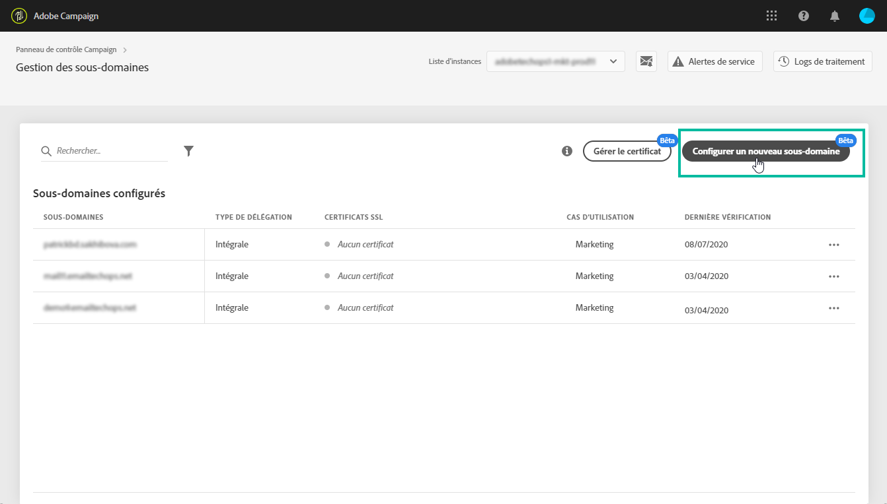
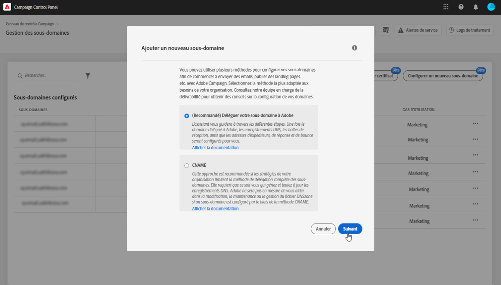

# Configuration d’un sous-domaine {#setting-up-subdomain}

Le Panneau de configuration vous permet de déléguer entièrement un sous-domaine à Adobe Campaign. Pour ce faire, suivez les étapes décrites ci-dessous.

>[!NOTE]
>
>L’utilisation de CNAME pour la délégation de sous-domaines n’est pas prise en charge par le Panneau de configuration. For more on this method, refer to [this page](https://helpx.adobe.com/campaign/kb/domain-name-delegation.html).

1. Dans la carte **[!UICONTROL Sous-domaines et certificats]**, sélectionnez une instance, puis cliquez sur le bouton**[!UICONTROL  Configurer un nouveau sous-domaine]** .

   

   >[!NOTE]
   >
   >Le bouton **[!UICONTROL Configuration du nouveau sous-domaine]**est disponible uniquement pour les instances Production.

1. Sélectionnez la méthode **[!UICONTROL Délégation à Adobe]**, puis cliquez sur**[!UICONTROL  Suivant]**.

   

1. Créez le sous-domaine souhaité dans la solution d’hébergement utilisée par votre entreprise. Pour ce faire, copiez les informations du serveur de noms Adobe affichées dans l’assistant, puis collez-les dans votre solution d’hébergement.

   Pour plus d’informations sur la création d’un sous-domaine dans une solution d’hébergement, reportez-vous au didacticiel vidéo accessible à partir de l’assistant.

   

   Une fois le sous-domaine créé avec les informations correspondantes du serveur de noms Adobe, cliquez sur **[!UICONTROL Suivant]**.

1. Sélectionnez le cas d’utilisation souhaité pour le sous-domaine :

   * **Communications** marketing : communications destinées à un usage commercial. Exemple : campagne par courrier électronique de vente.
   * **Communications** transactionnelles et opérationnelles : les communications transactionnelles contiennent des informations visant à terminer un processus que le destinataire a commencé avec vous. Exemple : confirmation d’achat, courrier électronique de réinitialisation du mot de passe. Les communications organisationnelles se rapportent à l&#39;échange d&#39;informations, d&#39;idées et de vues au sein et à l&#39;extérieur de l&#39;organisation, sans but commercial.
   La ventilation de vos sous-domaines selon cette méthode est une bonne pratique pour la délivrabilité. Ce faisant, la réputation de chaque sous-domaine est isolée et protégée. Par exemple, si votre sous-domaine pour les communications marketing est mis sur liste noire par les fournisseurs de services Internet, votre sous-domaine de communications transactionnelles ne sera pas affecté et continuera à être en mesure d’envoyer des communications.

   

   >[!NOTE]
   >
   >Vous pouvez uniquement sélectionner un cas d’utilisation qui a été configuré pour votre instance. Si l’instance a été configurée pour les communications marketing uniquement, vous ne pourrez pas sélectionner le cas d’utilisation des communications de transaction et d’opération.

1. Entrez le sous-domaine que vous avez créé dans votre solution d’hébergement avec les informations du serveur de noms Adobe, puis cliquez sur **[Envoyer]**.

   >[!NOTE]
   >
   > Veillez à renseigner le sous-domaine **complet** à déléguer. Par exemple, pour déléguer le sous-domaine &quot;usoffres.email.weretail.com&quot;, saisissez &quot;usoffres.email.weretail.com&quot;.

   

1. Une fois le sous-domaine envoyé, le Panneau de configuration effectue diverses opérations pour configurer le sous-domaine et vérifier qu’il pointe correctement vers l’instance de campagne (création d’enregistrements d’espace de noms, configuration d’instance de campagne, vérification des enregistrements de début d’autorité, etc.).

   Vous pouvez obtenir plus de détails sur l’avancement de la configuration à tout moment en cliquant sur le bouton Détails **[!UICONTROL du]**processus.

   

Qu&#39;obtenez-vous à la fin du processus ?
* Sous-domaine avec les enregistrements DNS suivants : SOA, MX, CNAME(s), DKIM, SPF, TXT.
* Sous-domaines supplémentaires pour héberger le miroir, la ressource, les pages de suivi et la clé de domaine
* Boîtes de réception - Expéditeur, erreur, réponse
* En fin de compte, les sous-domaines seront configurés pour fonctionner avec votre instance Adobe Campaign
