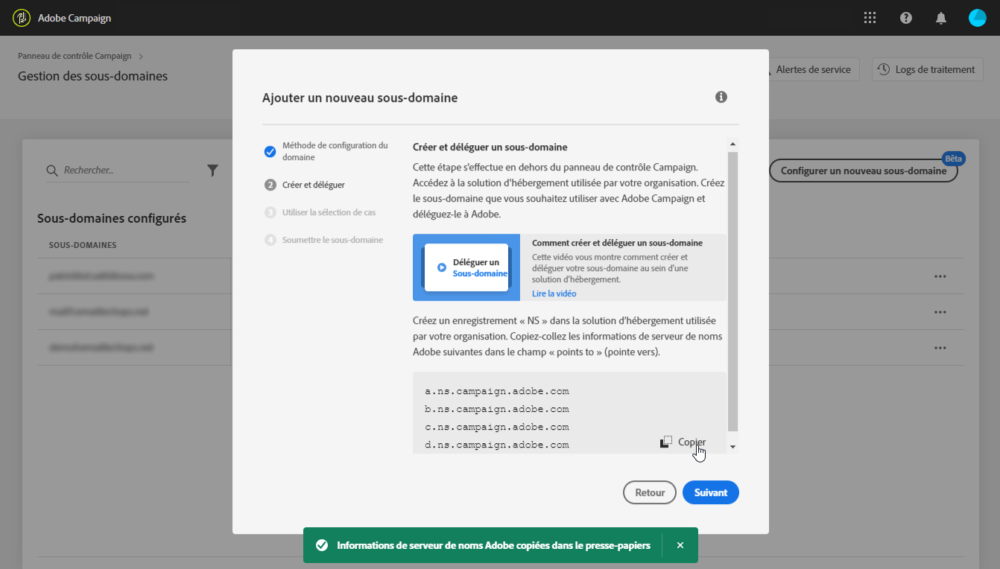

# Configuration d’un nouveau sous-domaine {#setting-up-subdomain}

>[!IMPORTANT]
>
>La délégation de sous-domaines du Panneau de configuration sera disponible en version bêta d&#39;ici la fin janvier et sujette à de fréquentes mises à jour et modifications sans préavis.

Si vous avez des questions sur les méthodes de délégation de sous-domaines, contactez l’équipe de délivrabilité d’Adobe ou contactez le service à la clientèle pour demander des conseils sur la délivrabilité.

## Délégation complète de sous-domaine {#full-subdomain-delegation}

Le Panneau de contrôle vous permet de déléguer entièrement un sous-domaine à Adobe Campaign. Pour ce faire, suivez les étapes suivantes.

>[!NOTE]
>
>Si l’instance sélectionnée ne comporte aucun sous-domaine précédemment configuré, le premier sous-domaine délégué à Adobe deviendra le sous-domaine **** principal de cette instance, vous ne pourrez plus le modifier à l’avenir.
>
>Les enregistrements DNS inversés seront créés pour d’autres sous-domaines utilisant le sous-domaine principal. Les adresses de réponse et de rebond pour les autres sous-domaines seront générées à partir du sous-domaine principal.

1. Dans la carte **[!UICONTROL Sous-domaines et certificats]**, sélectionnez l’instance de production souhaitée, puis cliquez sur**[!UICONTROL  Configurer un nouveau sous-domaine]**.

   

   >[!NOTE]
   >
   >Subdomain delegation is available for **production** instances only.

1. Cliquez sur **[!UICONTROL Suivant]**pour confirmer votre choix de la méthode de délégation complète.

   

   >[!NOTE]
   >
   >Les méthodes [CNAME](#use-cnames) et personnalisées ne sont actuellement pas prises en charge par le Panneau de contrôle.

1. Créez le sous-domaine et les serveurs de noms souhaités dans la solution d’hébergement utilisée par votre entreprise. Pour ce faire, copiez et collez les informations du serveur de noms Adobe affichées dans l’assistant. For more on how to create a subdomain in a hosting solution, refer to the [tutorial video](https://video.tv.adobe.com/v/30175?captions=fre_fr).

   >[!CAUTION]
   >
   >Lors de la configuration des serveurs de noms, veillez à **ne jamais déléguer votre sous-domaine racine à Adobe**. Sinon, le domaine ne pourra fonctionner qu’avec Adobe. Toute autre utilisation sera impossible, comme par exemple envoyer des courriers électroniques internes aux employés de votre entreprise.

   

   Une fois le sous-domaine créé avec les informations du serveur de noms Adobe correspondantes, cliquez sur **[!UICONTROL Suivant]**.

1. Sélectionnez le cas d’utilisation souhaité pour le sous-domaine :

   * **Communications marketing** : communications destinées à un usage commercial. Exemple : campagne par email de vente.
   * **Communications** transactionnelles et opérationnelles : les communications transactionnelles contiennent des informations visant à terminer un processus que le destinataire a commencé avec vous. Exemple : confirmation d’achat, email de réinitialisation de mot de passe. Les communications organisationnelles se rapportent à l&#39;échange d&#39;informations, d&#39;idées et de vues au sein et à l&#39;extérieur de l&#39;organisation, sans but commercial.
   >[!NOTE]
   >
   >La ventilation de vos sous-domaines selon les cas d’utilisation est une bonne pratique en matière de délivrabilité. Elle permet d’isoler et de protéger la réputation de chaque sous-domaine.
   >
   >Par exemple, si votre sous-domaine de communications marketing est placé sur liste noire par les fournisseurs de services Internet, votre sous-domaine de communications transactionnelles ne sera pas affecté et pourra encore envoyer des communications.

   

1. Entrez le sous-domaine que vous avez créé dans votre solution d’hébergement, puis cliquez sur **[!UICONTROL Envoyer]**.

   >[!NOTE]
   >
   > Veillez à indiquer le **nom complet** du sous-domaine à déléguer. Par exemple, pour déléguer le sous-domaine « usoffers.email.weretail.com », saisissez « usoffers.email.weretail.com ».

   

1. Une fois le sous-domaine envoyé, le Panneau de configuration vérifie qu’il pointe correctement vers les enregistrements Adobe NS et que l’enregistrement de début d’autorité (SOA) n’existe pas pour ce sous-domaine.

1. Si les vérifications sont réussies, le Panneau de configuration commencera à configurer le sous-domaine avec des enregistrements DNS, des URL supplémentaires, des boîtes de réception, etc. Pour afficher plus de détails sur la progression de la configuration, cliquez sur le bouton **[!UICONTROL Détails du processus]**.

   

   >[!NOTE]
   >
   >Dans certains cas, la délégation est effectuée, mais le sous-domaine peut ne pas être vérifié. Le sous-domaine va directement dans la liste des sous-domaines ****vérifiés avec l’état**[!UICONTROL  Non vérifié]** et un journal des tâches fournissant des informations sur l’erreur. Contactez le service à la clientèle si vous rencontrez des problèmes pour résoudre le problème.
   >
   >Notez que, pendant l’exécution de la délégation de sous-domaine, d’autres requêtes par l’intermédiaire du Panneau de configuration seront entrées dans une file d’attente et exécutées uniquement une fois la délégation de sous-domaine terminée, afin d’éviter tout problème de performances.

A la fin du processus, les sous-domaines seront configurés pour fonctionner avec votre instance Adobe Campaign et les éléments ci-dessous seront créés :

* **Le sous-domaine** avec les **enregistrements DNS** suivants : SOA, MX, CNAME, DKIM, SPF et TXT
* **Sous-domaines** supplémentaires pour héberger le miroir, la ressource, les pages de suivi et la clé de domaine,
* **Boîtes de réception** : Expéditeur, Erreur, Réponse

>[!NOTE]
>
>Par défaut, la boîte de réception &quot;Répondre&quot; du Panneau de configuration est configurée pour effacer les courriers électroniques et ne peut pas être révisable. Si vous souhaitez surveiller votre boîte de réception de réponse pour vos campagnes marketing, n’utilisez pas cette adresse.

You can get more details on the subdomain by clicking the **[!UICONTROL Subdomain Details]**button.

>[!NOTE]
>
>En plus de l’étape de traitement, Adobe informera l’équipe de délivrabilité du nouveau sous-domaine afin de contrôler le sous-domaine créé. Le processus de vérification peut prendre jusqu’à 3 jours après la délégation du sous-domaine.
>
>Les contrôles effectués comprennent les boucles de commentaires et les tests de boucles de plaintes de spam. Nous vous déconseillons donc d&#39;utiliser le sous-domaine avant la fin de la vérification, car cela pourrait entraîner une mauvaise réputation du sous-domaine.

## Utilisation des CNAME {#use-cnames}

L’utilisation de CNAME pour la délégation de sous-domaines n’est pas prise en charge par le Panneau de configuration. Pour utiliser cette méthode, contactez le service à la clientèle Adobe.
